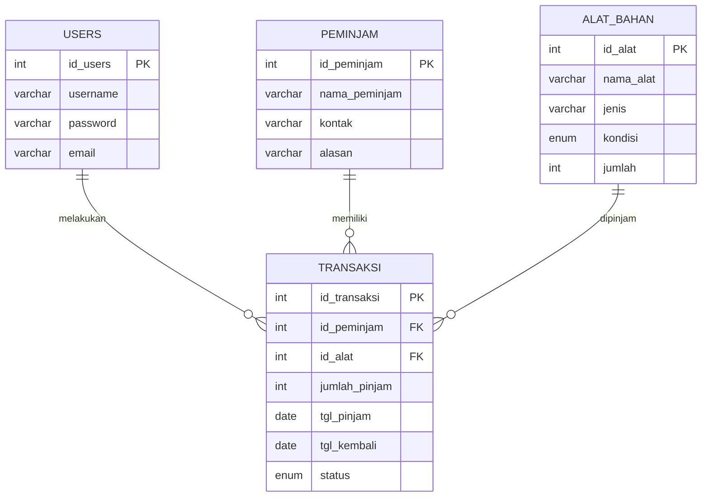

# INVENTA ✨🎨

**Sistem Manajemen Peminjaman Alat dan Bahan Prakarya Ekstrakurikuler Sekolah**


---

## 🧭 Tentang Project

**INVENTA** adalah sistem manajemen digital yang dirancang untuk mempermudah sekolah dalam mengelola peminjaman alat dan bahan prakarya. Sistem ini menggabungkan **desain modern**, **fitur otomatisasi**, dan **analitik data** agar proses inventaris menjadi lebih cepat, efisien, dan transparan.

---

## 🪄 Fitur Utama

* 🧰 **Manajemen Inventaris** – Kelola data alat & bahan prakarya dengan mudah.
* 🔄 **Sistem Peminjaman** – Pencatatan peminjaman dan pengembalian otomatis.
* 👩‍🏫 **Data Peminjam** – Informasi siswa/guru lengkap dengan riwayat transaksi.
* 📈 **Dashboard Analytics** – Visualisasi statistik inventaris dan aktivitas peminjaman.
* 🔐 **Authentication System** – Login dan role management yang aman.


---

## ⚙️ Teknologi yang Digunakan

### Frontend


### Backend


### Database


---

## 🧩 ERD (Entity Relationship Diagram)



---

## 🧱 Struktur Database (Master Data)

| **Entity**     | **Deskripsi**                         | **Hubungan**           |
| -------------- | ------------------------------------- | ---------------------- |
| **Users**      | Data pengguna sistem (admin, petugas) | 1 : N → Transaksi      |
| **Alat_Bahan** | Master data alat dan bahan prakarya   | 1 : N → Transaksi      |
| **Peminjam**   | Data siswa/guru peminjam              | 1 : N → Transaksi      |
| **Transaksi**  | Catatan peminjaman alat & bahan       | N : 1 → Peminjam, Alat |


---

## 🎨 Desain UI/UX

### Style & Visuals

* 🩵 **Glassmorphism**: Efek transparan dengan bayangan lembut.
* 🌈 **Pastel Color Palette**: Warna lembut yang nyaman untuk mata.
* 📱 **Fully Responsive**: Adaptif di perangkat desktop dan mobile.
* 🧭 **Animated Dashboard**: Statistik interaktif dan grafik real-time.


---

## 🔧 API Endpoints

### Authentication

```http
POST /api/login
POST /api/register
POST /api/logout
```

### Alat & Bahan

```http
GET /api/alat-bahan
POST /api/alat-bahan
PUT /api/alat-bahan/{id}
DELETE /api/alat-bahan/{id}
```

### Transaksi

```http
GET /api/transaksi
POST /api/transaksi
PUT /api/transaksi/{id}
```

---

## 📊 Statistik & Analytics

| Statistik           | Deskripsi                    |
| ------------------- | ---------------------------- |
| 🔢 Total Alat/Bahan | Jumlah item di inventaris    |
| 🔄 Total Transaksi  | Aktivitas peminjaman/kembali |
| 👥 Jumlah Peminjam  | Data peminjam aktif          |
| ⚙️ Kondisi Barang   | Barang baik / rusak / hilang |


---

## 👥 Tim Pengembang

| Role                    | Nama                             | Kontribusi                      |
| ----------------------- | -------------------------------- | ------------------------------- |
| 💻 Full Stack Developer | Muhammad Panca Raditya Pamungkas | Pengembangan sistem & backend   |
| 🎨 UI/UX Designer       | Muhammad Panca Raditya Pamungkas | Desain visual & user experience |
| 🧠 Database Architect   | Muhammad Panca Raditya Pamungkas | Desain skema database & ERD     |

---

## 📞 Kontak

📧 **[radityapanca02@gmail.com](mailto:radityapanca02@gmail.com)**
🐙 **GitHub:** [radityapanca02/inventa-v2](https://github.com/radityapanca02/inventa-v2)

---

<div align="center">

### ⭐ Jangan lupa beri bintang jika project ini membantu!

> *"Mengelola inventaris sekolah dengan lebih efisien dan modern"*


</div>
